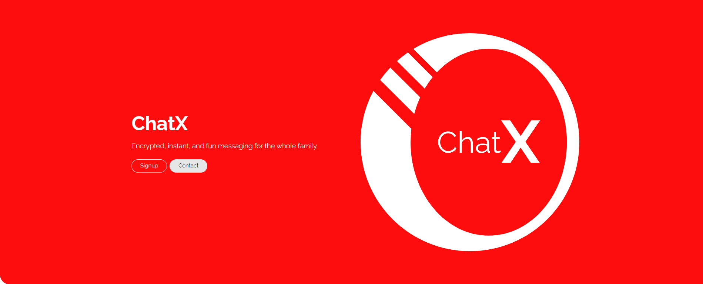
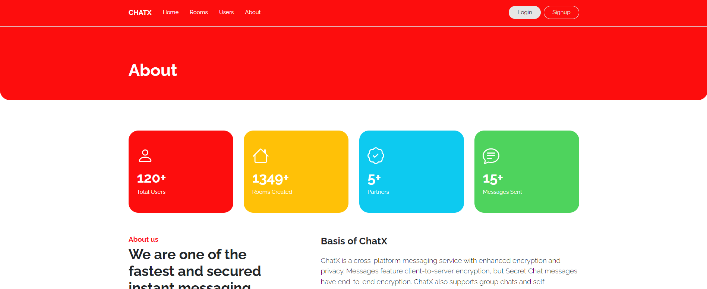
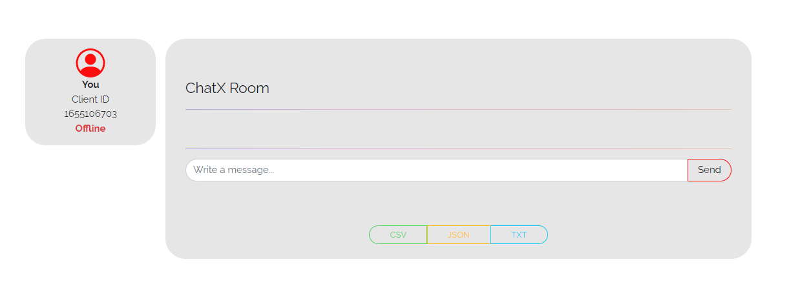

<br/>
<a href="https://chatx.konradjoz.com" target="_blank">
    
</a>

<p align="center" style="font-size: 2.5em; font-family: Raleway, serif"> Chat<b>X</b> - Simply Powerful</p>
<div align="center">
  <span display="inline" height="20px">
    
  </span>
  <span display="inline" height="20px">
    
  </span>
  <span display="inline" height="20px">
    
  </span>
</div>

<hr style="   background: linear-gradient(to right, #0f00ff, #cf00be, #ff007a, #ff0041, #ff5500);"/>

## Features

+ Read and write user data to MongoDB
+ Websocket communication between backend and frontend
+ Custom routes and components
+ Bootstrap 5 Desktop and Mobile focused design

## Screenshots

<div>




</div>

## Tech Stack

- [FastAPI](https://fastapi.tiangolo.com/) - Asynchronous backend (ASGI)
- [MongoDB](https://mongodb.com/) - NoSQL database for retrieval of documents
- [React](https://reactjs.org/) - Javascript UI components for modern web apps
- [Bootstrap 5](https://getbootstrap.com/) - Mobile first styling for all components (simple & sleek)

## Installation

``` 
git clone 
```

```
cd frontend/
# Install npm Dependencies
npm install package.json
npm start

# Install pip Dependencies
cd ..
cd backend/
pip3 install -r requirements.txt
main.py -m uvicorn backend.main:app --reload
```

** Note: I recommend the compound configuration provided by many
JetBrains products (WebStorm, PyCharm, etc.)

## RoadMap

+ <b>React</b>
    - [ ] Create profile, room, and user routes
    - [ ] Fix websocket close errors
    - [ ] Add download routes for message history

+ <b>FastApi</b>
    - [ ] Add async POST routes for messages
    - [ ] Add async GET protected routes for sensitive user data
    - [ ] Update database package for reusability

+ <b>Bootstrap</b>
    + [ ] Add GSAP animations for logo, titles, and components
